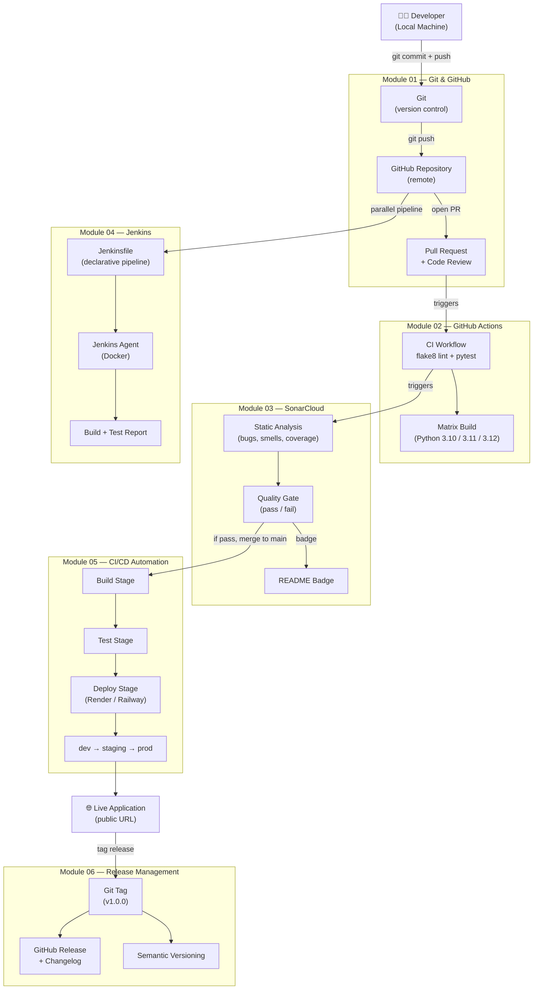

# High Level Design — DevOps Learning Project

This diagram shows how all 6 modules connect together into a single end-to-end DevOps pipeline.
A developer writes code locally, pushes to GitHub, and automated tools take it all the way to a live deployment.

---

## Tool Roles at a Glance

| Tool | Role | When it runs |
|------|------|-------------|
| **Git** | Track every code change locally | Continuously while coding |
| **GitHub** | Host code, PRs, Actions, Releases | On push / PR |
| **GitHub Actions** | Automate lint, test, deploy | On push / PR / tag |
| **SonarCloud** | Enforce code quality standards | On every PR |
| **Jenkins** | Enterprise-grade pipeline (self-hosted) | On push (via webhook) |
| **Render / Railway** | Host the deployed application | After CI passes |
| **Semantic Versioning** | Structure releases predictably | On tag push |
