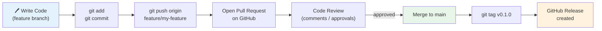
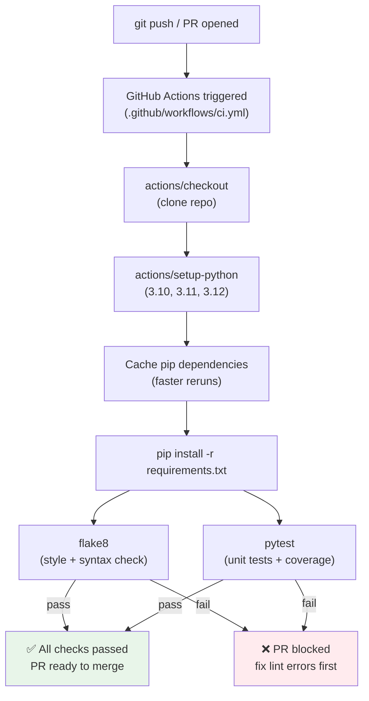
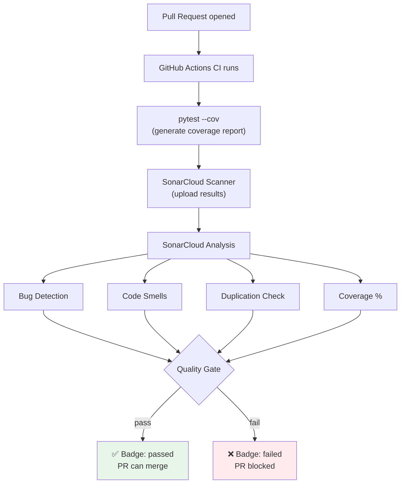
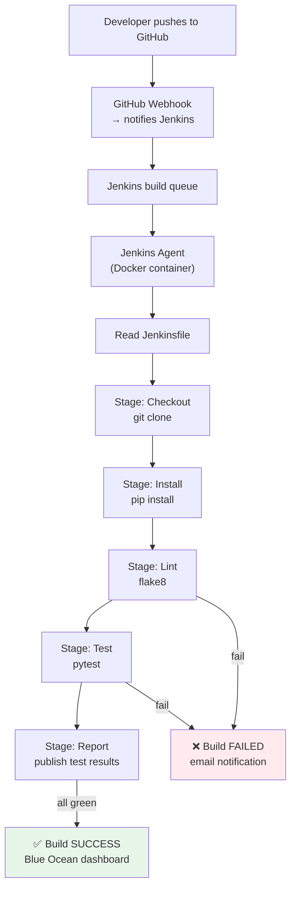
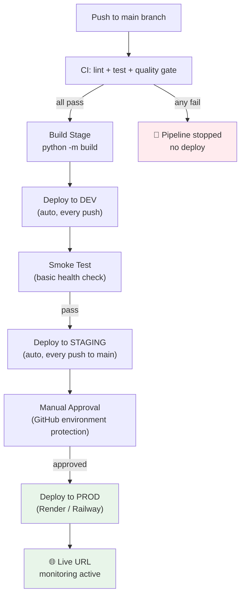
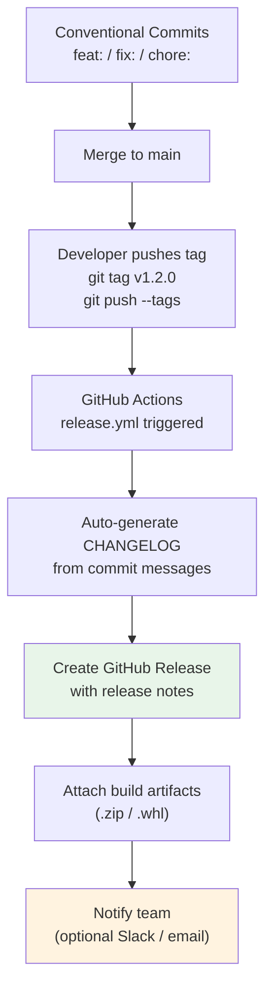

# Low Level Design — Per Module Pipelines

Detailed flow for each module showing exactly what happens at each step.

---

## Module 01 — Git & GitHub Fundamentals

**Key files:** `.gitignore`, `CHANGELOG.md`, branch protection rules

---

## Module 02 — GitHub Actions CI Pipeline

**Key files:** `.github/workflows/ci.yml`, `requirements.txt`, `tests/`

---

## Module 03 — SonarCloud Code Quality Gate

**Key files:** `sonar-project.properties`, `.github/workflows/sonar.yml`

---

## Module 04 — Jenkins Pipeline (Self-hosted)

**Key files:** `Jenkinsfile`, `docker-compose.yml` (local Jenkins)

---

## Module 05 — Full CI/CD Pipeline (Code to Live)

**Key files:** `.github/workflows/deploy.yml`, `render.yaml` or `railway.json`

---

## Module 06 — Release Management

**Versioning rules:**
- `feat:` commit → bumps **minor** version (1.0.0 → 1.1.0)
- `fix:` commit → bumps **patch** version (1.0.0 → 1.0.1)
- `BREAKING CHANGE` → bumps **major** version (1.0.0 → 2.0.0)

**Key files:** `.github/workflows/release.yml`, `CHANGELOG.md`, `.commitlintrc`
